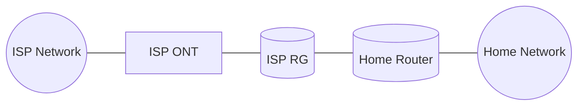

# Problem Description

Our home network has a globally routeable IPv6 `/60` prefix via ISP DHCPv6 PD. 

From this the ISP Router-Gateway (**RG**) uses DHCPv6 PD again to assign a `/64`. The assigned `/64` changed unexpectedly, breaking IPv6 services.

Example:

`2001:db8:0:0::/60` - The `/60`, allows networks `0-f`  
`2001:db8:0:1::/64` - The `/64` previously assigned.  
`2001:db8:0:2::/64` - The newly assigned `/64`, now all the static addresses need to be re-assigned.  

For stable static addressing from a dynamic pool to work, address hints are required.

Address hinting is the equipment going "please give me this prefix". The ISP RG did not implement this functionality.

*See [RFC 8415](https://www.rfc-editor.org/rfc/rfc8415.txt) (18.2.1)*

Our equipment had non-routeable IPv6 addresses with no valid IPv6 default gateway.

# Action Plan
Implement a bypass to talk directly to the ISP ONT and ISP DHCPv6 PD server and become our own IPv6 gateway.
 

# Previous Engineer
* Removed IPv6 from router
* Removed AAAA DNS entries from router
* Implemented bypass (removed ISP RG)
* Dumped certs from ISP RG
* Configured 802.1x on router using dumped certs

# Valerie's Work
**Note:** The project was then handed off to me so the previous engineer could sleep, with the goal of having the network up and running before it was needed again in the morning.

**802.1x is broken.**

**802.1x is needed** for any traffic to be trusted on the ONT link, including DHCPv6.

Router WAN port is mirrored into Wireshark to observe the 802.1x negotiation in real time. 

In the captures, negotiation fails. The ONT does not respond to the router's packets.

The router's dot1x configuration and packets are fine, but the router is reporting the wrong time by several minutes. 

The router is a Mikrotik with no internal battery. After manually correcting the time, 802.1x sometimes completes.

Handshake completion is inconsistent. Why?

In packet captures, the ONT is now responding every time, but the router doesn't always continue the handshake. Why?

The ONT responses are tagged as being part of VLAN 0. Mikrotik routers have notably inconsistent handling of packets tagged with VLAN 0.

WAN interface gets grouped into a bridge (logical) interface by itself. Bridge is set to strip the VLAN tags from all ingress packets. 802.1x starts working immediately and consistently.

The prefix hint that the previous engineer configured now works correctly, and we are able to access all of the /60 address space that is assigned to us.
